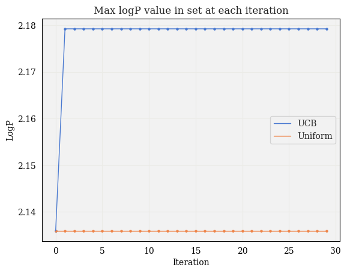
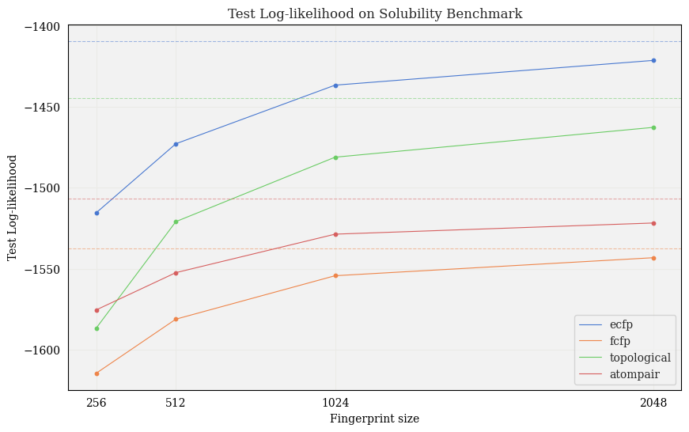
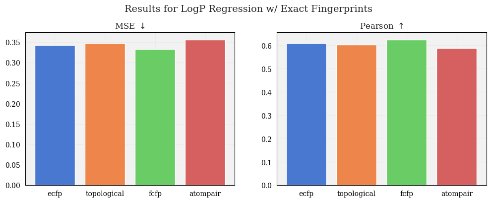

# Jan 15

* Preliminary BO experiment:
  * Used UCB acquisition function, compared to uniform sampling
  * Plotted value of best sample in observations set at each iteration:

* Evaluated test log-likelihood for different fingerprints:

* Tested GP with adjusted mean
  * Computed mean of training data
  * Subtracted mean from training data, yielding "centered" data
  * Trained on centered data
  * Predicted mean, var of test data, then added mean of training data back to predicted mean

$\rightarrow$ Slightly improved results

* Code changes:
  * Modifications to `tanimoto_gp.py`: included class option for nonzero-mean GP
  * Created `utils.py`

* Questions / Ideas:
  * How to assess BO experiment? For example, I can look at highest value in set, diversity, etc.
  * What is the proper way to update gp?
  * How to structure directory to make code more modular?
  * Can plot Tanimoto similarity between x's at consecutive interations for BO experiment

# Dec 17

### Updates:

* Tested GP on 4 different fingerprint types:
  * Extended connectivity
  * Functional Connectivity
  * Topological
  * Atompair
* Evaluated on Polaris solubility dataset:
 

 
 

### Next steps:

- [x] Currently using ZeroMeanGP $\rightarrow$ Instead, calculate mean of training set and add to mean of GP

- [x] Visualize test log likelihood
  <!-- * Every data point has a corresponding uncertainty
  * Evaluate the log likelihood using [this function](https://jax.readthedocs.io/en/latest/_autosummary/jax.scipy.stats.multivariate_normal.logpdf.html) from JAX
  * Input to M.V. normal is supposed to be y, i.e., give it the mean and var from the GP, then give it y and see the likelihood of that data point
  * I'll want to get the full covariance matrix for this from the `tanimoto_gp.py` script -->

- [ ] Make script more general for upcoming Polaris competitions
  * Pass `.csv` files with train/test data as input
  * Script outputs predictions, or submits to Polaris, etc.
  
- [ ] Try BO experiments:
  * Use offline dataset (e.g., Polaris logP training dataset)
  * Procedure:
     1. Pick some fraction of dataset (~20%)
     2. Train GP on this fraction
     3. Define an acquisition function (e.g., UCB, EI, etc.)
     4. At each iteration, make predictions for _all_ unlabeled points
     5. Choose molecule with highest acquisition value $\rightarrow$ Evaluate logP, add to training data
     6. Repeat
  * compare to random baseline (i.e., compare to selecting molecule based on uniform distribution)

- [ ] Try some experiments w/ less trivial dataset (e.g., DockString, PMO, etc.)
