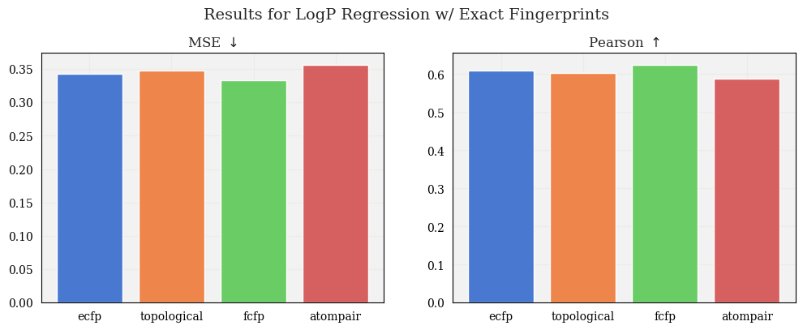

### Questions:
* Should we include 4096 fingerprint size in the experiment? I am ommitting 256
* Should we be using consistent GP params?

---

# Jan 15

### Updates:

* Ran preliminary BO experiment

* Tested GP with adjusted mean
  * Computed mean of training data
  * Subtracted mean from training data, yielding "centered" data
  * Trained on centered data
  * Predicted mean, var of test data, then added mean of training data back to predicted mean

$\rightarrow$ Slightly improved results

* Code changes:
  * Modifications to `tanimoto_gp.py`: included class option for nonzero-mean GP
  * Created `utils.py`

### Next Steps:

- [x] Clone repos instead of copy

- [x] Implement tolerance for GP param optimization $\rightarrow$ re-run fingerprint comparison

- [ ] Make parameters configurable from command line (fptype, sizes, radius, tol, etc.)

- [ ] Keep track of GP params for experiments

- [ ] Modify BO experiment:
  * Start w/ less points, different split, $n$ worst molecules, etc.
  * Fit parameters on larger subset of data, then run BO on complement, e.g.,
    * Take 1000/2000 molecules, maximize MLL
    * Using parameters, initialize GP and run BO experiment on remaining data,
      starting with a small subset of molecules (e.g., 100-200 of remaining 1000)

- [ ] Run BO on harder tasks (Dockstring, PMO, etc.)
  * Hopefully will observe increasing difference in performance between model
    exact fingerprint vs. limited fingerprint w.r.t. iterations

- [ ] Make script more general for upcoming Polaris competitions

# Dec 17

### Updates:

* Tested GP on 4 different fingerprint types:
  * Extended connectivity
  * Functional Connectivity
  * Topological
  * Atompair
* Evaluated on Polaris solubility dataset:
 

 
 

### Next steps:

- [x] Currently using ZeroMeanGP $\rightarrow$ Instead, calculate mean of training set and add to mean of GP

- [x] Visualize test log-likelihood
  
- [x] Preliminary BO experiment:
  * Use offline dataset (e.g., Polaris logP training dataset)
  * Procedure:
     1. Pick some fraction of dataset (~20%)
     2. Train GP on this fraction
     3. Define an acquisition function (e.g., UCB, EI, etc.)
     4. At each iteration, make predictions for _all_ unlabeled points
     5. Choose molecule with highest acquisition value $\rightarrow$ Evaluate logP, add to training data
     6. Repeat
  * Compare to random baseline (i.e., compare to selecting molecule based on uniform distribution)