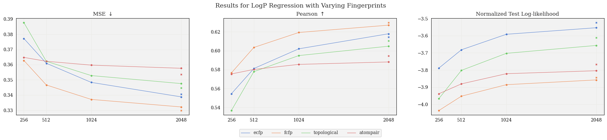
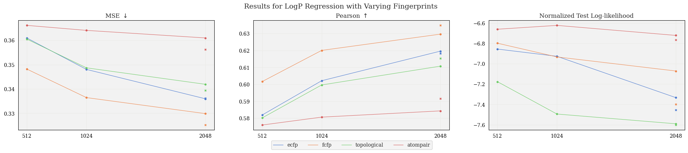
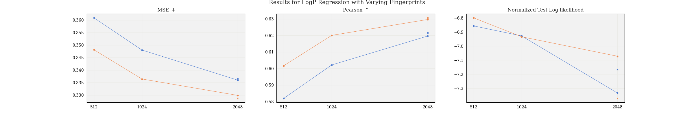

# Experiments

## Bayes Opt comparison

Preliminary BO experiment:
 * Used UCB acquisition function, compared to uniform sampling
 * Plotted value of best sample in observations set at each iteration:
<p align="center">

</p>

## Fingerprint comparison

Here we compared the performance of TanimotoGP with different fingerprints, specifically looking at the the performance difference using exact fingerprints vs. fingerprints of a limited size.

Moreover, we varied the `radius` parameter (only applicable for `ecfp` and `fcfp` fingerprint types), with the hypothesis that a larger radius would lead to more hash collisions, and thus there would be an increased gap in performance as we increased the size of the fingerprints.


### Experiment #1, initial fingerprint comparison (parameters: `radius=2`):

* Complete fingerprint comparison, showing MSE, Pearson, and TLL:
<p align="center">

</p>

As expected, we see an improvement in performance as the fingerprint size increases.


### Experiment #2 (parameters: `radius=4`):

<p align="center">

</p>

We can see that the increased number of hash collisions decreases performance for limited-size fingerprints.


### Experiment #3 (parameters: `radius=2`, `tol=1e-3)`

* Implemented gradient norm tolerance criteria for optimization loop, got improved results with `tol=1e-3`:

<p align="center">

</p>

To run this experiment:

```py
python3 evaluate_fingerprints.py --generate_data --make_plots --savefig --filename '1e-3/fingerprint_comparison'
```
with parameters:
* `tol = 1e-3`
* `fps = ['ecfp', 'fcfp', 'topological', 'atompair']`
* `sizes = [512, 1024, 2048]`
* `radius = 2`


### Experiment #4 (parameters: `radius=4`, `tol=1e-3`):

Interestingly, we don't see the same trend as we saw in experiment #2. I wonder if this is due to overfitting, since the experiment is the same, we only adjusted `tol`.

<p align="center">

</p>

To run this experiment:

```py
python3 evaluate_fingerprints.py --generate_data --make_plots --savefig --filename '1e-3/fp_comparison_r4_1e-3'
```
with parameters:
* `tol = 1e-3`
* `fps = ['ecfp', 'fcfp']`
* `sizes = [512, 1024, 2048]`
* `radius = 4`