# Experiments

## Bayesian Optimization Comparison

Histogram of dataset:

<p align="center">

</p>

**Experiment setup**:
1. Split dataset in half, optimize GP hyperparameters on one half
2. Save other half for BO $\rightarrow$ call this the "BO dataset" (~1000 molecules)
3. Train a new GP on 10% of the BO dataset, using previously optimized GP hyperparameters
4. Perform BO, starting with initial 10%, measuring best molecule at each iteration
5. Repeat steps 3-4 five times, then plot the mean best value at each iteration, with error bars representing 1 std

The figures on the left show the results when taking a random split of the BO dataset to train the initial GP. The figures on the right show the results when starting with the bottom 10% of the BO dataset (Note that running ucb in the case where we start with the $n$ worst molecules is the same each time, as there is no random split of the data). The 3 rows of figures correspond to running the experiments with the UCB $\beta$ parameter set to $0.1, 1, \text{ and } 10$, respectively.


<p align="center">
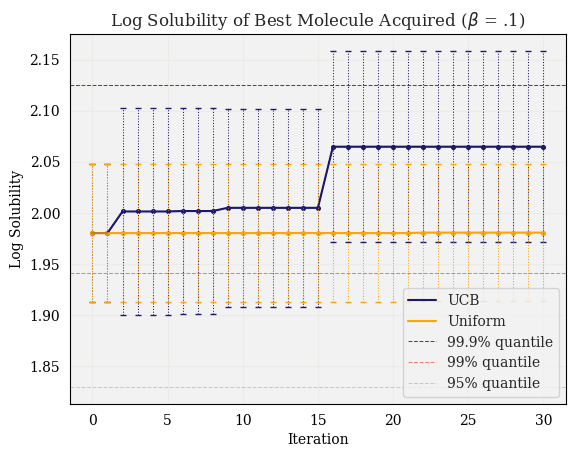
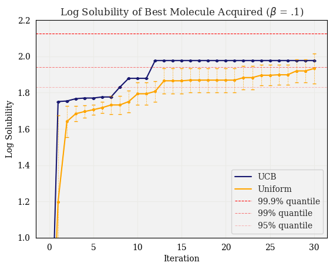
</p>

<p align="center">
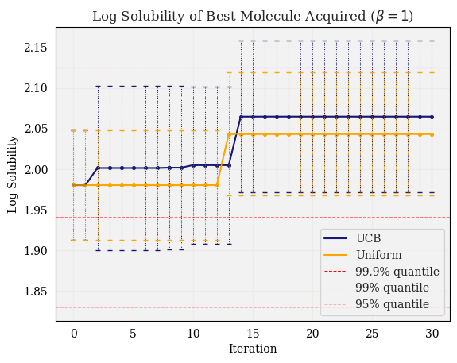
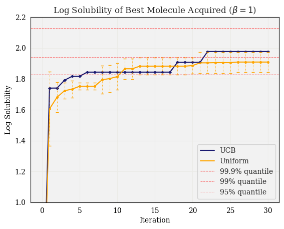
</p>

<p align="center">
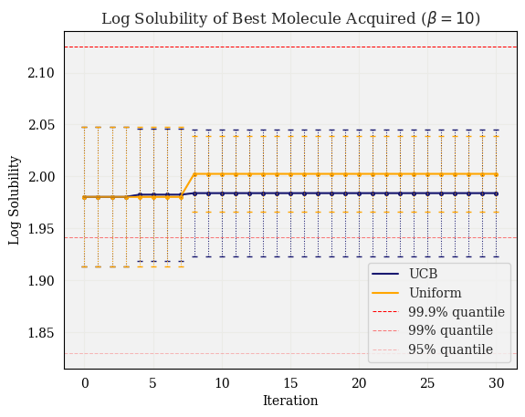
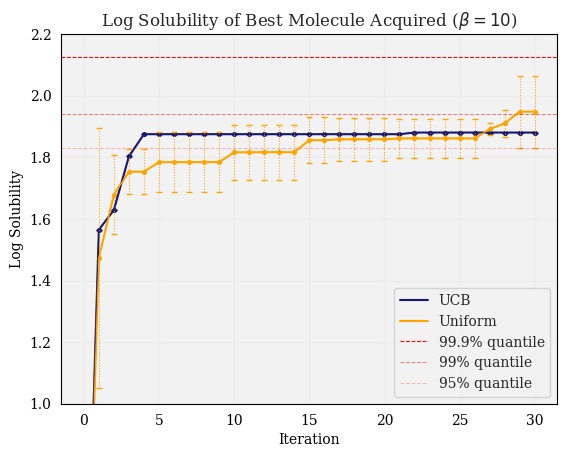
</p>

The following figures show the results for the same experiments as above, but measuring the number of molecules acquired which are in the top 10% of the BO dataset:

<p align="center">
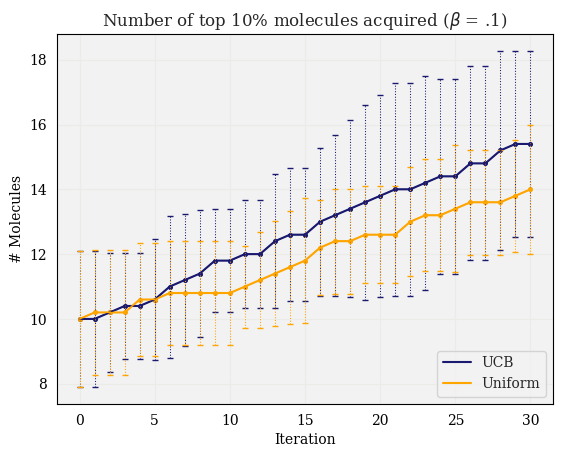
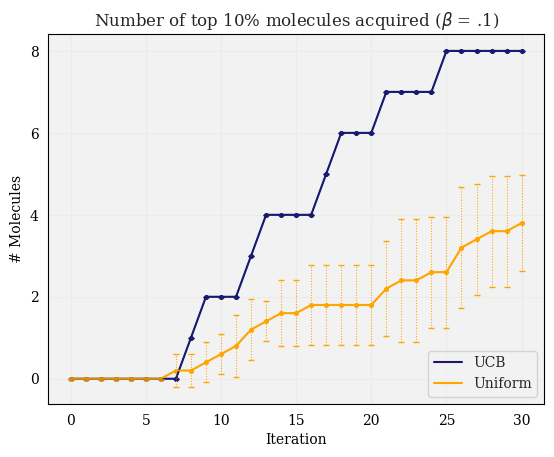
</p>

<p align="center">
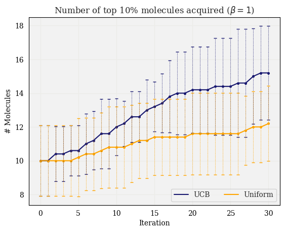
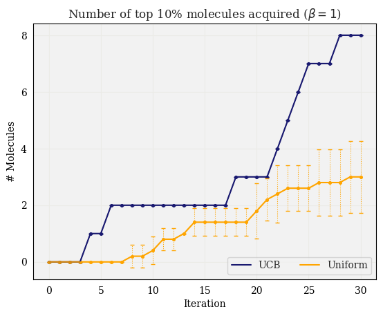
</p>

<p align="center">
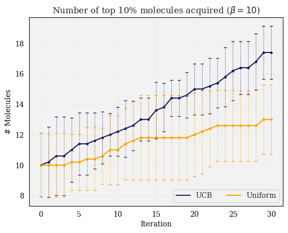
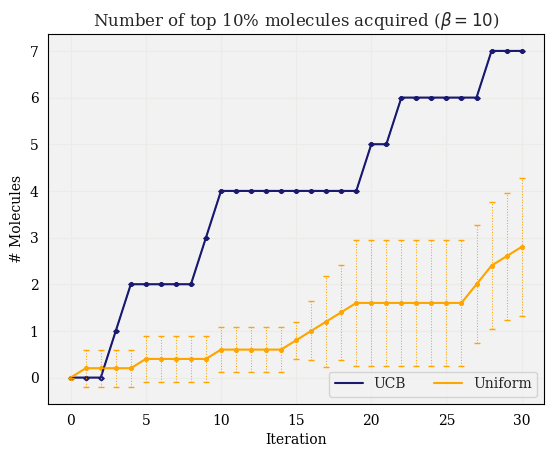

<!-- To run:

```py
python3 bo_exp1.py --split_method 'n_worst' --split 0.1 --num_iters 30
``` -->

## Fingerprint comparison

Here we compared the performance of TanimotoGP with different fingerprints, specifically looking at the the performance difference using exact fingerprints vs. fingerprints of a limited size.

Moreover, we varied the `radius` parameter (only applicable for `ecfp` and `fcfp` fingerprint types), with the hypothesis that a larger radius would lead to more hash collisions, and thus there would be an increased gap in performance as we increased the size of the fingerprints.

<!-- 
### Parameters: `radius=2`:

<p align="center">

</p>

As expected, the performance improves with as the size of the fingerprint increases.

### Parameters: `radius=4`:

<p align="center">

</p>

We can see that the increased number of hash collisions decreases performance for limited-size fingerprints. -->


### Parameters: `radius=2`, `tol=1e-3`

<p align="center">

</p>

GP parameters:

<p align="center">

</p>

To run this experiment:

```py
python3 evaluate_fingerprints.py --exp 'r2_1e-3' --generate_data --make_plots --savefig --radius 2 --tol 1e-3
```
with parameters:
* `tol = 1e-3`
* `fps = ['ecfp', 'fcfp', 'topological', 'atompair']`
* `sizes = [512, 1024, 2048]`
* `radius = 2`


### Parameters: `radius=4`, `tol=1e-3`:

<p align="center">

</p>

GP parameters:

<p align="center">

</p>

To run this experiment:

```py
python3 evaluate_fingerprints.py --exp 'r4_1e-3' --generate_data --make_plots --savefig --radius 4 --tol 1e-3
```
with parameters:
* `tol = 1e-3`
* `fps = ['ecfp', 'fcfp']`
* `sizes = [512, 1024, 2048]`
* `radius = 4`