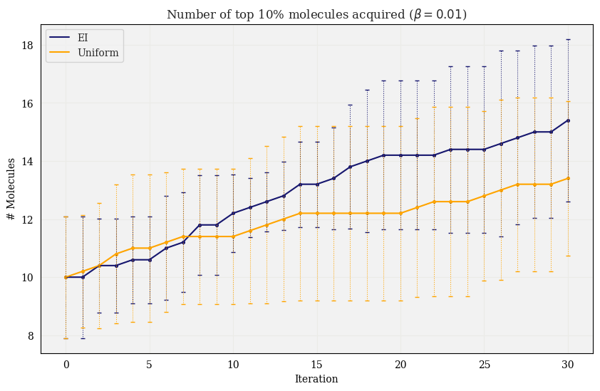
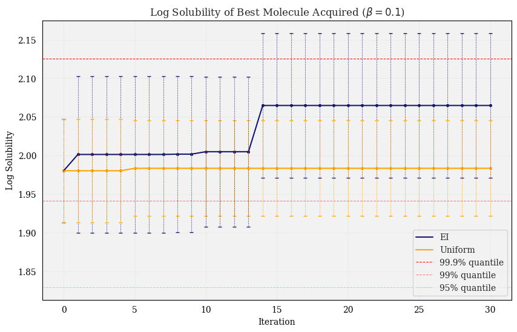
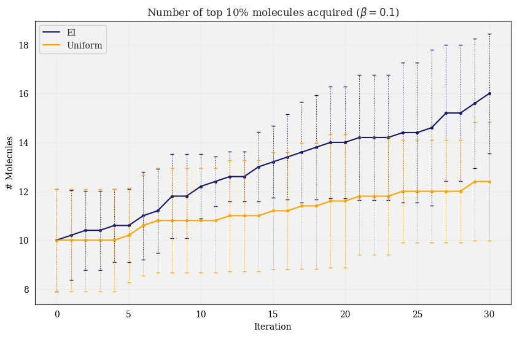
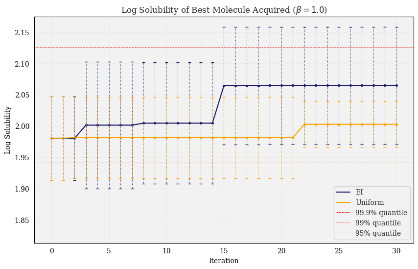
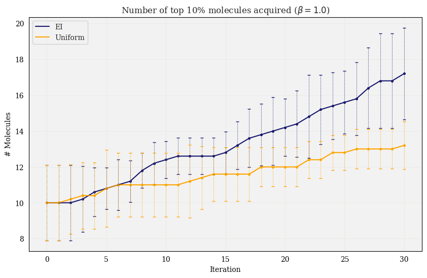

# Experiments

1. [Dockstring Comparison](#dockstring-comparison)
2. [Bayesian Optimization Comparison](#bayesian-optimization-comparison)
3. [Fingerprint comparison](#fingerprint-comparison)

## Dockstring Comparison

## Bayesian Optimization Comparison

Histogram of dataset:

<p align="center">

</p>

**Experiment setup**:
1. Split dataset in half, optimize GP hyperparameters on one half
2. Save other half for BO $\rightarrow$ call this the "BO dataset" (~1000 molecules)
3. Train a new GP on 10% of the BO dataset, using previously optimized GP hyperparameters
4. Perform BO, starting with initial 10%, measuring best molecule at each iteration
5. Repeat steps 3-4 five times, then plot the mean best value at each iteration, with error bars representing 1 std

The figures on the left show the highest scoring molecule in the acquired dataset at each iteration when using the EI acquisition function. The figures on the right show the number of molecules in the acquired dataset which are in the top 10% of the BO dataset at each iteration. The 3 rows of figures correspond to running the experiments with the EI tradeoff parameter set to $0.1, 1, \text{ and } 10$, respectively.

See the same results when using the UCB [here](experiments/ucb.md)

<p align="center">


</p>

<p align="center">


</p>

<p align="center">


</p>

To run:

```py
python3 bo_exp.py 
```

Parameters:

* `--split`, default: 0.1 (Size of initial set of observed molecules at the start of BO)
* `--acq`, default: 'ei' (Acquisiton function; options are EI or UCB)
* `--beta`, default: 0.1
* `--num_iters`, default: 30
* `--savefig`, default: False (Set true to save figure to `figures/` directory)
* `--split_method`, default: `random` (Option to choose initial set of observed molecules as bottom fraction of BO dataset, set to `n_worst`)

## Fingerprint Comparison

Here we compared the performance of TanimotoGP with different fingerprints, specifically looking at the the performance difference using exact fingerprints vs. fingerprints of a limited size.

Moreover, we varied the `radius` parameter (only applicable for `ecfp` and `fcfp` fingerprint types), with the hypothesis that a larger radius would lead to more hash collisions, and thus there would be an increased gap in performance when using uncompressed vs. compressed fingerprints.


### Parameters: `radius=2`, `tol=1e-3`

<p align="center">

</p>

GP parameters:

<p align="center">

</p>

To run this experiment:

```py
python3 evaluate_fingerprints.py --exp 'r2_1e-3' --generate_data --make_plots --savefig --radius 2 --tol 1e-3
```
with parameters:
* `tol = 1e-3`
* `fps = ['ecfp', 'fcfp', 'topological', 'atompair']`
* `sizes = [512, 1024, 2048]`
* `radius = 2`


### Parameters: `radius=4`, `tol=1e-3`:

<p align="center">

</p>

GP parameters:

<p align="center">

</p>

To run this experiment:

```py
python3 evaluate_fingerprints.py --exp 'r4_1e-3' --generate_data --make_plots --savefig --radius 4 --tol 1e-3
```
with parameters:
* `tol = 1e-3`
* `fps = ['ecfp', 'fcfp']`
* `sizes = [512, 1024, 2048]`
* `radius = 4`