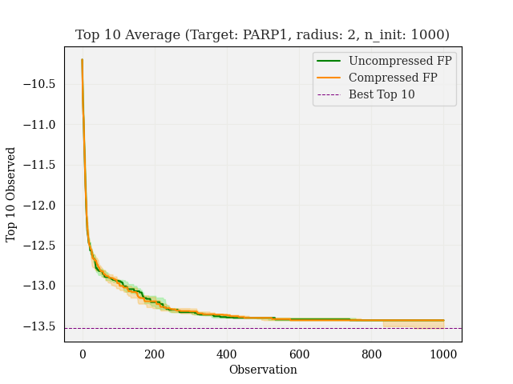
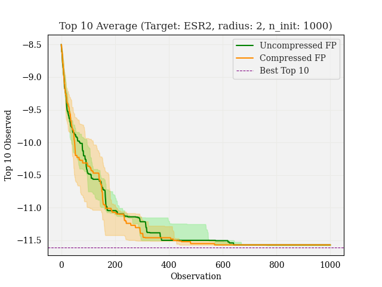

# Experiments

1. [Dockstring Comparison](#dockstring-comparison)
2. [Bayesian Optimization Comparison](#bayesian-optimization-comparison)
3. [Fingerprint comparison](#fingerprint-comparison)

**Note:** All experiments must be ran from the `code/` directory.

## Dockstring Comparison

### BO Experiments

Here we are comparing BO procedures when using four different fingerprint types:

* Uncompressed count ECFP, radius 2
* Compressed count ECFP, size 1024, radius 2
* Uncompressed count ECFP, radius 4
* Compressed count ECFP, size 1024, radius 4

**Dataset:**

Dataset is training dataset from Dockstring (10k molecules). Initial observations are randomly sampled from bottom 80% of dataset. Distributions are shown:

<p align="center">


</p>

**Experiment setup:**

1. Initialize GP on `n_init` molecules taken from bottom 80% of dataset, use GP params from 10k regression exp
2. Perform BO for `budget` iterations
3. Measure best molecule, and average of top 10 molecules at each iteration
4. Repeat for 3 different splits of dataset, plot median, min, and max for best molecule and top 10 at each iteration
5. Compare performance with compressed and uncompressed fingerprints

**Results:**

<p align="center">


</p>

<p align="center">


</p>

<p align="center">


</p>

<p align="center">


</p>


### Regression Experiments

**Experiment setup:**

Here we are evaluating GP models on the Dockstring regression benchmark, varying the fingerprint parameters as follows:

* Compressed binary `ecfp` fingerprint w/ radius 2
* Compressed count `ecfp` fingerprint w/ radius 2
* Sparse binary `ecfp` fingerprint w/ radius 2
* Sparse count `ecfp` fingerprint w/ radius 2

The evaluation pipeline:

1. Download dockstring dataset
2. Train GP model on training set of 10k molecules
3. Evaluate R2 score on ~38k test set
4. Repeat for `PARP1` and `F2` targets

**Results:**

| Target | Compressed binary | Compressed count | Sparse binary | Sparse count
| ----- | ----- | ----- | ----- | ----- |
| PARP1 | .735 | .855 | .787 | **.866** |
| F2 | .756 | .820 | -- | **.833** | 
| ESR2 | -- | .512 | -- | **.542** |


**Benchmark:**

<p align="center">

</p>

To run:

```py
python3 dockstring-regression.py 
```

Parameters:

* `--from_checkpoint`, default: False (Set to true to load trained model from `models/` directory)
* `--path` (Specify model path)
* `--n_train`, default: 10000 (Number of training samples)
* `--target`, default: "PARP1" (Regression target)


## Bayesian Optimization Comparison

Histogram of dataset:

<p align="center">

</p>

**Experiment setup**:
1. Split dataset in half, optimize GP hyperparameters on one half
2. Save other half for BO $\rightarrow$ call this the "BO dataset" (~1000 molecules)
3. Train a new GP on 10% of the BO dataset, using previously optimized GP hyperparameters
4. Perform BO, starting with initial 10%, measuring best molecule at each iteration
5. Repeat steps 3-4 five times, then plot the mean best value at each iteration, with error bars representing 1 std

The figure on the left show the highest scoring molecule in the acquired dataset at each iteration when using the EI acquisition function. The figure on the right show the number of molecules in the acquired dataset which are in the top 10% of the BO dataset at each iteration.

<p align="center">


</p>

To run:

```py
python3 bo_exp.py 
```

Parameters:

* `--split`, default: 0.1 (Size of initial set of observed molecules at the start of BO)
* `--acq`, default: 'ei' (Acquisiton function; options are EI or UCB)
* `--epsilon`, default: 0.01
* `--num_iters`, default: 30
* `--savefig`, default: False (Set true to save figure to `figures/` directory)
* `--split_method`, default: `random` (Option to choose initial set of observed molecules as bottom fraction of BO dataset, set to `n_worst`)

See the same results when using UCB [here](experiments/ucb.md)


## Fingerprint Comparison

Here we compared the performance of TanimotoGP with different fingerprints, specifically looking at the the performance difference using exact fingerprints vs. fingerprints of a limited size.

Moreover, we varied the `radius` parameter (only applicable for `ecfp` and `fcfp` fingerprint types), with the hypothesis that a larger radius would lead to more hash collisions, and thus there would be an increased gap in performance when using uncompressed vs. compressed fingerprints.


### Parameters: `radius=2`, `tol=1e-3`

<p align="center">

</p>

GP parameters:

<p align="center">

</p>

To run this experiment:

```py
python3 evaluate_fingerprints.py --exp 'r2_1e-3' --generate_data --make_plots --savefig --radius 2 --tol 1e-3
```
with parameters:
* `tol = 1e-3`
* `fps = ['ecfp', 'fcfp', 'topological', 'atompair']`
* `sizes = [512, 1024, 2048]`
* `radius = 2`


### Parameters: `radius=4`, `tol=1e-3`:

<p align="center">

</p>

GP parameters:

<p align="center">

</p>

To run this experiment:

```py
python3 evaluate_fingerprints.py --exp 'r4_1e-3' --generate_data --make_plots --savefig --radius 4 --tol 1e-3
```
with parameters:
* `tol = 1e-3`
* `fps = ['ecfp', 'fcfp']`
* `sizes = [512, 1024, 2048]`
* `radius = 4`