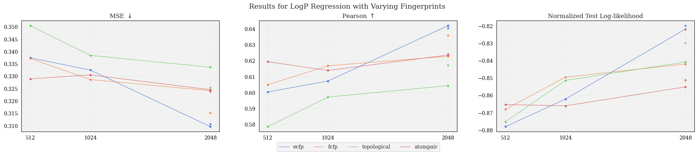
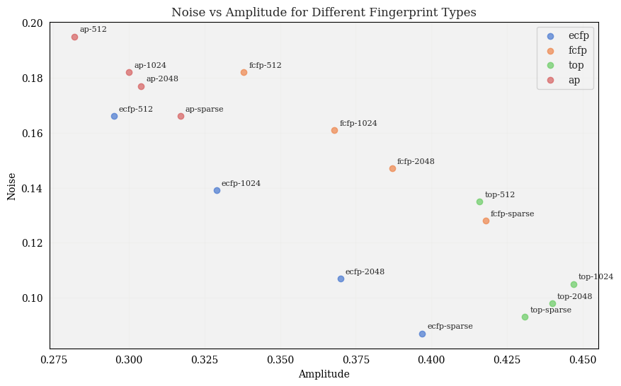
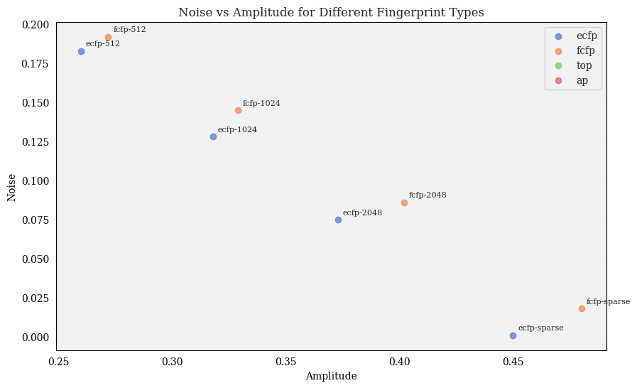

# Experiments

## Bayes Opt comparison


### BO experiment #1:
 * Used UCB acquisition function, compared to uniform sampling
 * Plotted value of best sample in observations set at each iteration:
<p align="center">

</p>

 * Made the task more difficult: started with bottom 10% of library, compared UCB to uniform:

<p align="center">

</p>

To run:

```py
python3 bo_exp1.py --split_method 'n_worst' --split 0.1 --num_iters 30
```

## Fingerprint comparison

Here we compared the performance of TanimotoGP with different fingerprints, specifically looking at the the performance difference using exact fingerprints vs. fingerprints of a limited size.

Moreover, we varied the `radius` parameter (only applicable for `ecfp` and `fcfp` fingerprint types), with the hypothesis that a larger radius would lead to more hash collisions, and thus there would be an increased gap in performance as we increased the size of the fingerprints.

<!-- 
### Parameters: `radius=2`:

<p align="center">

</p>

As expected, the performance improves with as the size of the fingerprint increases.

### Parameters: `radius=4`:

<p align="center">

</p>

We can see that the increased number of hash collisions decreases performance for limited-size fingerprints. -->


### Parameters: `radius=2`, `tol=1e-3`

<p align="center">

</p>

GP parameters:

<p align="center">

</p>

To run this experiment:

```py
python3 evaluate_fingerprints.py --exp 'r2_1e-3' --generate_data --make_plots --savefig --radius 2 --tol 1e-3
```
with parameters:
* `tol = 1e-3`
* `fps = ['ecfp', 'fcfp', 'topological', 'atompair']`
* `sizes = [512, 1024, 2048]`
* `radius = 2`


### Parameters: `radius=4`, `tol=1e-3`:

<p align="center">

</p>

GP parameters:

<p align="center">

</p>

To run this experiment:

```py
python3 evaluate_fingerprints.py --exp 'r4_1e-3' --generate_data --make_plots --savefig --radius 4 --tol 1e-3
```
with parameters:
* `tol = 1e-3`
* `fps = ['ecfp', 'fcfp']`
* `sizes = [512, 1024, 2048]`
* `radius = 4`