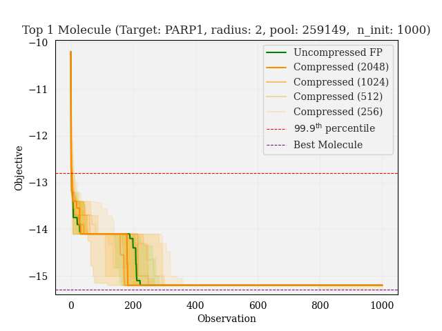
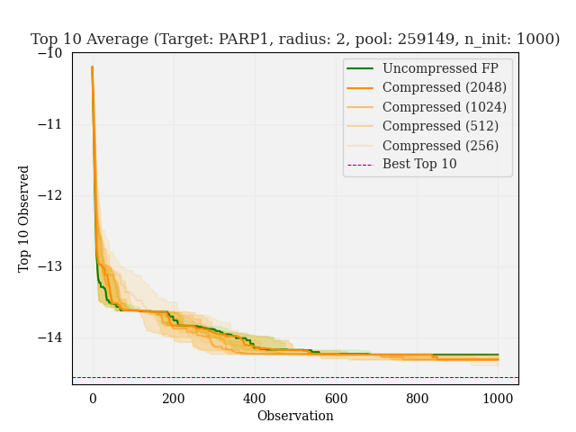
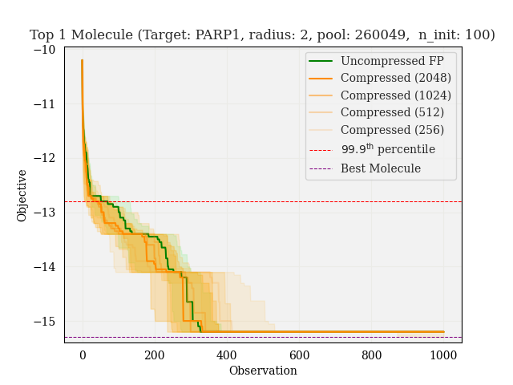
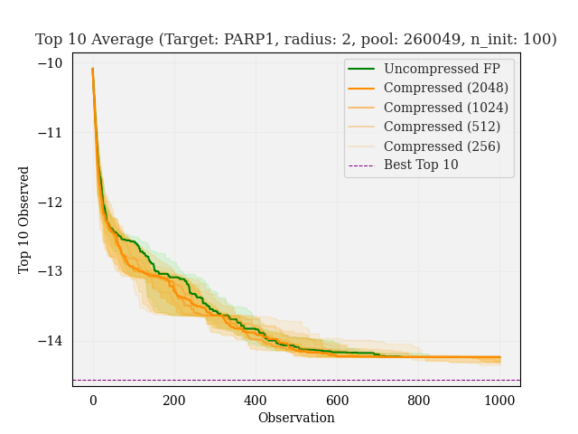
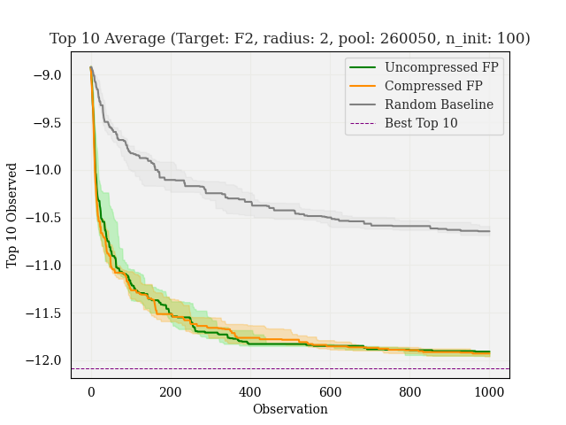
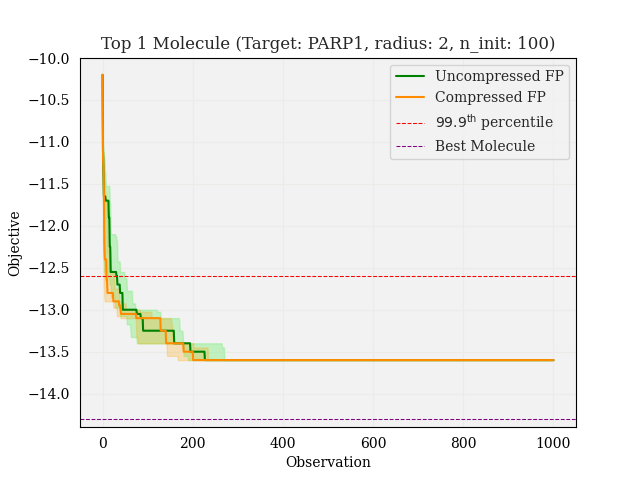
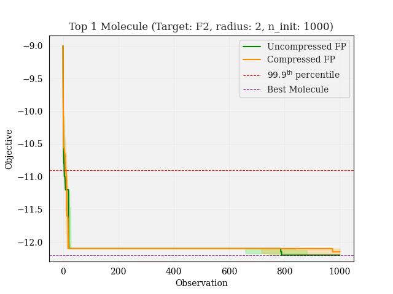
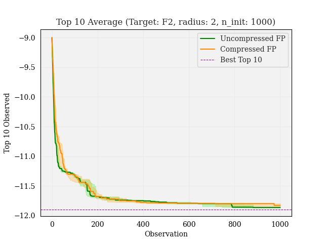
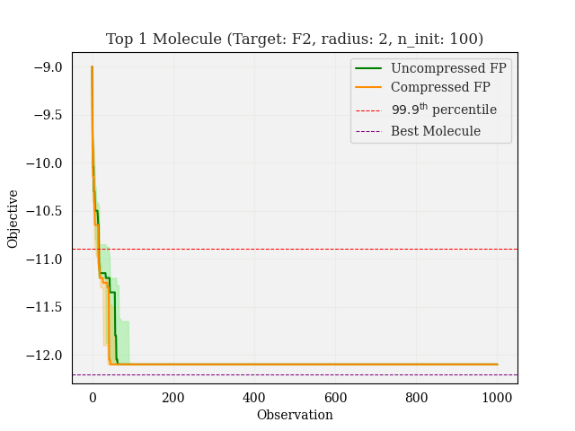
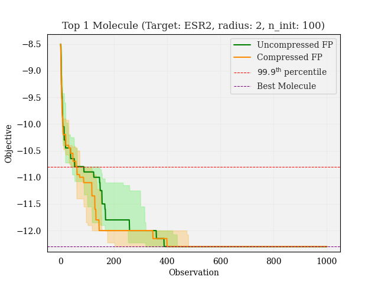

# BO experiments on DOCKSTRING dataset

**Experiment details:** For a given configuration of parameters (e.g., `target` $=$ "PARP1", `pool` $=$ "max", `n_init`$= 1000$, `budget` $=1000$), I am comparing the performance of different fingerprints for BO. To do so, I start with the same dataset for each fingerprint (`sparse`, `compressed2048`, `compressed1024`, etc.), and run 30 trials of BO for each. Then, I plot the median, 1st quartile, and 3rd quartile at each iteration, recording both the best molecule found, and the average of the top 10 molecules.

## Target: `PARP1`

It's interesting to see that the BO performance does not seem to depend on the fingerprint size. Note that we are running the experiments for 100, 1000 initial molecules. Comparing to the corresponding regression experiments, there doesn't seem to be a substantial advantage in predictive accuracy for any fingerprint.

<!-- R4 -->

<!-- 

 -->

<!--
## Target: `F2`

## Target: `ESR2`

## Target: `PGR`

# Preliminary:

## Target: `PARP1`

## Target: `F2`

## Target: `ESR2`

## Target: `PGR`

