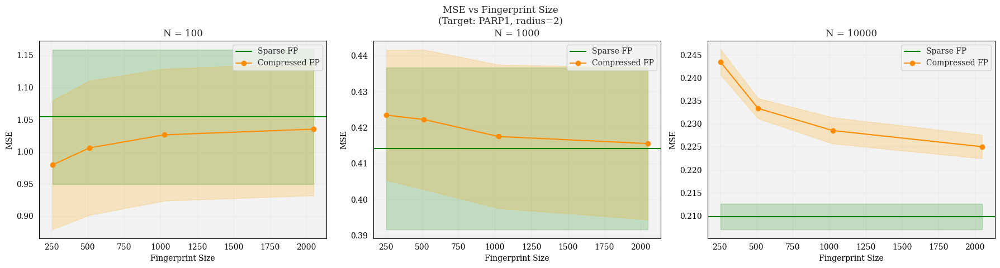

# Regression experiments on DOCKSTRING dataset

**Experiment details:** For a given fingeprint configuration, I ran 30 trials on different random splits of the training dataset, and predicted the target values of the test dataset (~38k molecules). I am reporting the average across 30 trials, plus/minus 1 standard deviation.

# Target: `PARP1`

Interestingly, we see that for `n_train` $= 100$, we are seeing performance *decrease* as the fingerprint size increases. We see the expected relationship, however, for `n_train` $= 1000, 10000$:

