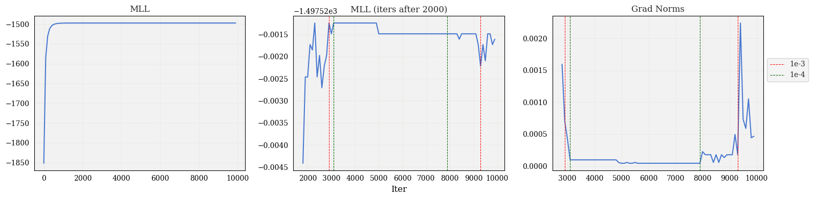
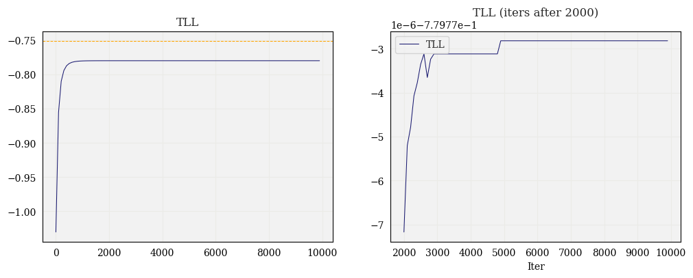
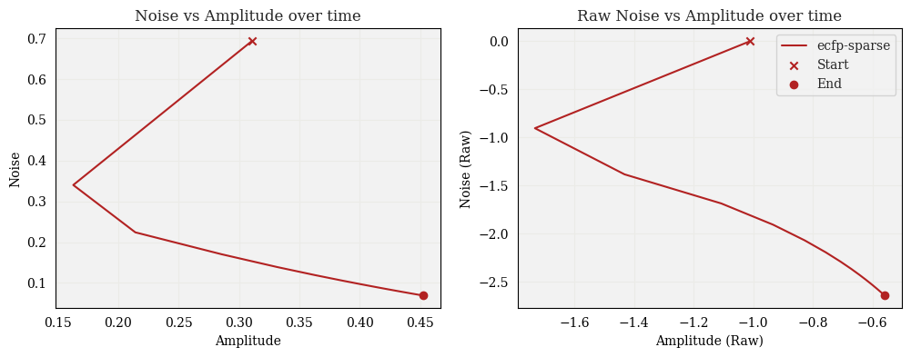
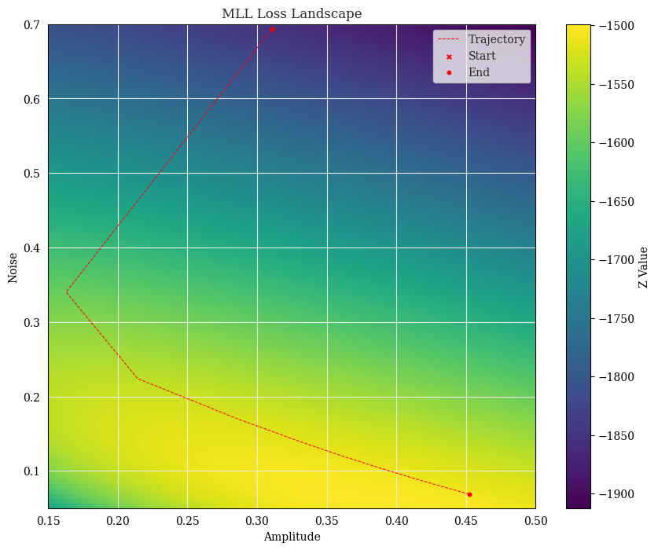

# GP Parameter Diagnosis

## MLL over time

**Experiment setup**: Here I fixed a fingerprint (`ecfp-sparse`), and ran hyperparameter fitting until `1e-5` convergence or `max_iters=10000` was reached. In this case, the maximum number of iterations was reached. On every 100th iteration, I evaluated the MLL.

Here, I've plotted the MLL versus the iterations. The **first plot** shows the whole scale of the MLL.

The **second plot** shows the MLL after the 2000th iteration, which better illuminates the behavior as the gradient norm gets small. There are two pairs of vertical lines: red and green. The first of each vertical line shows the first evaluation at which the gradient norm was below the given threshold (`1e-3` and `1e-4`, respectively). The second of each pair of lines shows the point at which the gradient norm crossed above the threshold for the first time after crossing below the threshold. As you can see, the MLL was at a maximum between iteration 3000 and 8000, then decreased and fluctuated at the end.

The **third plot** shows the value of the gradient norm and corresponds to the second plot.

*Thought*: I am also considering making more frequent evaluations in areas of interest, e.g., where MLL starts to drop again or where it fluctuates.

## TLL over time

Similar to the previous experiment, I also evaluated the TLL at every 100th iteration. To my surprise, the TLL is monotonically decreasing w.r.t. iterations. I've also plotted the baseline performance, using `y.var()` as the amplitude parameter and `0.1*amplitude` as the noise parameter. This seems to be strictly worse than all other parameters found during gradient descent.

## Hyperparameter Trajectory and Loss Landscape

Here I plot the hyperparameter trajectories in both the "natural" space (i.e., after softplus transformation) and "raw" space (before softplus transformation). I also plotted the natural trajectory over the loss landscape. The behavior here seems more or less what I'd expect when picturing gradient descent on a contour plot.

*Thought*: One thing I noticed here is that the hyperparameters are all identical in natural space after the ~60th evaluation (all stored with 5 digits of precision). I am wondering if this is due to numerical issues when applying softplus / inverse softplus, and I can look into this if it's of importance.

Furthermore, I plotted the loss landscape with finer evaluations (i.e., I "zoomed in") close to the minimum, but the shape of the loss function looked the same.