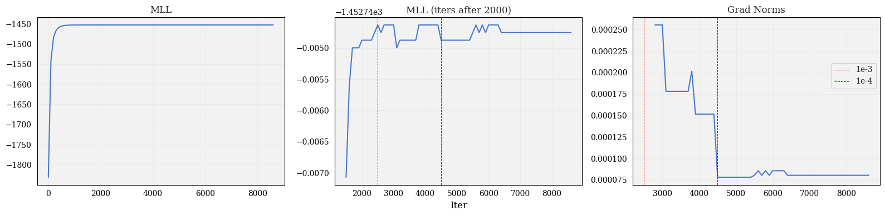
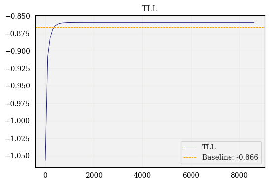
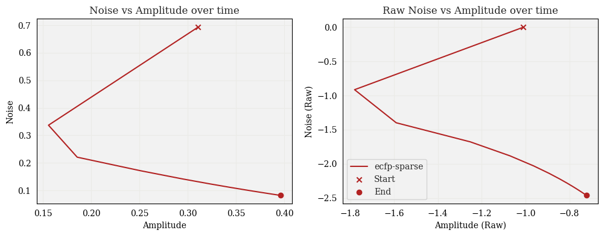

# GP Parameter Diagnosis

## MLL over time

**Experiment setup**: Here I fixed a fingerprint (`ecfp-sparse`), and ran hyperparameter fitting until `1e-5` convergence or `max_iters=10000` was reached. In this case, the maximum number of iterations was reached. On every 100th iteration, I evaluated the MLL.

* **First plot** shows the whole scale of the MLL w.r.t. iteration.

* **Second plot** shows the MLL after the 2000th iteration, which better illuminates the behavior as the gradient norm gets small. Each vertical line shows the first evaluation at which the gradient norm was below the given threshold (`1e-3` and `1e-4`, respectively).

* **Third plot** shows the value of the gradient norm and corresponds to the second plot.

<!-- *Thought*: I am also considering making more frequent evaluations in areas of interest, e.g., where MLL starts to drop again or where it fluctuates. -->

## TLL over time

Similar to the previous experiment, I also evaluated the TLL at every 100th iteration. I've also plotted the baseline performance, using `y.var()` as the amplitude parameter and `0.1*amplitude` as the noise parameter.

## Hyperparameter Trajectory and Loss Landscape

Here I plot the hyperparameter trajectories in both the "natural" space (i.e., after softplus transformation) and "raw" space (before softplus transformation). I also plotted the natural trajectory over the loss landscape. The behavior here seems more or less what I'd expect when picturing gradient descent on a contour plot.

Furthermore, I plotted the loss landscape with finer evaluations (i.e., I "zoomed in") close to the minimum, but the shape of the loss function looked the same (i.e., I wasn't able to observe any fluctuations at a smaller scale that I couldn't see on the larger scale).

Here, I adjusted the colors to better observe the loss close to the minimum:

